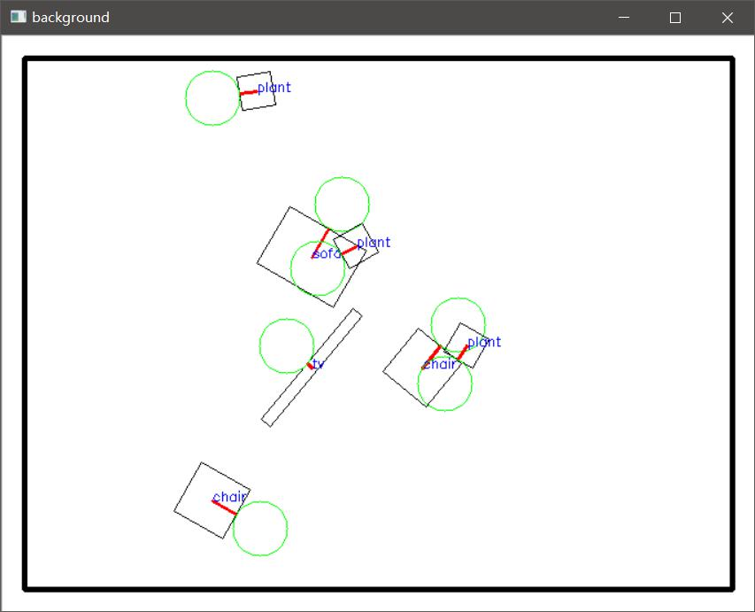
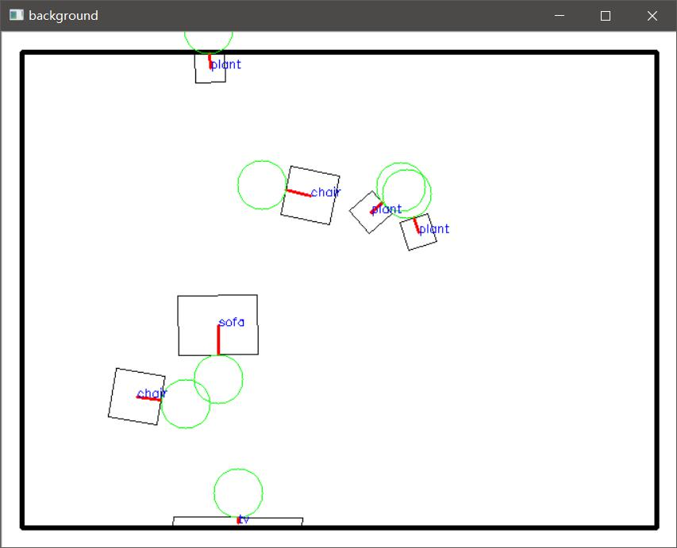
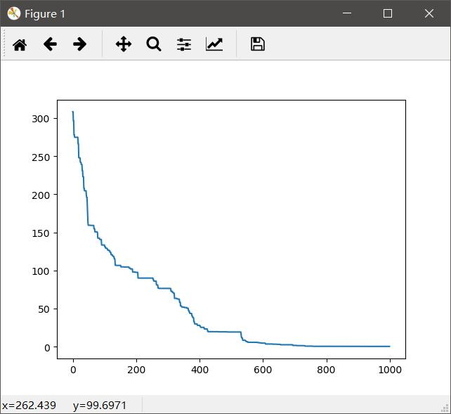

# Make it home

This is a optimization problem.

For convenience, I define a rectangle room with a sofa, a tv, two chairs and three plants. (But it's very easy to extend this scene by adding all kinds of objects)

As you can see, the objects are randomly placed in the room.

And each object has its own **size**, **direction**(red line) and **accessibility area**(green circle).

After 1000 iterations, they are well placed. As you can see.

The result is :

- TV is **on** the wall.
- Sofa is right in front of TV and the distance is 2 meters(We can change it freely).
- All the objects are not **overlapped**.
- All the objects has it's own **area**(Green circle), maybe except the plants.

As you can see, the result is good, and you can easily get another result just to change the cost function.

The cost is as below:

The whole process is placed in the root directory as a gif. 

By applying simulated annealing the process could be fast at first and gradually slow down until   it is finished. Also I use some tricks to make the result better.

Feel free to change the code if you want more interesting result. But you may install **python-opencv**， **python-matplotlib** and **python-numpy** first.